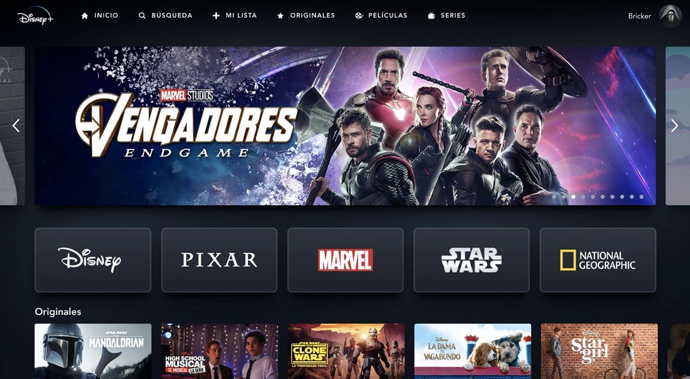
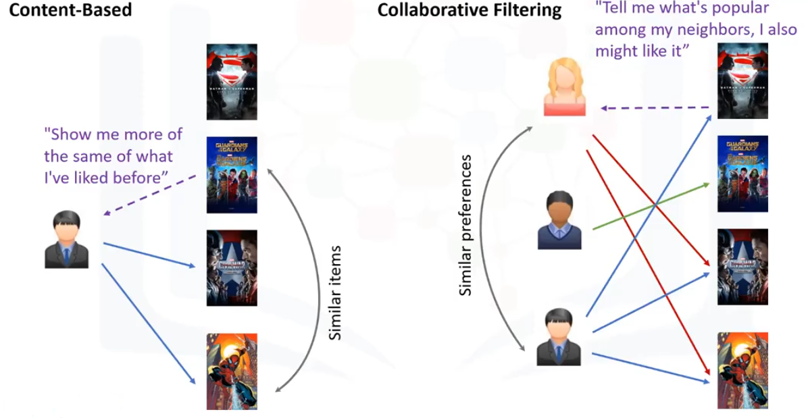

🎥

 Sistema de Recomendación de Películas - Tu Compañero Perfecto en la Búsqueda de la Película Ideal
Descripción del Proyecto
¿Alguna vez te has encontrado indeciso frente a una lista interminable de películas, sin saber cuál elegir? Imagina tener un sistema que entienda tus gustos y te sugiera películas que realmente disfrutarás. Este proyecto es precisamente eso: un viaje para crear la herramienta definitiva que te acompañe en tu búsqueda de la experiencia cinematográfica perfecta.

Este repositorio contiene todo lo necesario para desarrollar un Sistema de Recomendación de Películas. Desde la limpieza y transformación de los datos hasta la implementación de un modelo de recomendación, culminando en una API que podrás consultar desde cualquier lugar, este proyecto te llevará por un recorrido completo en el mundo del Machine Learning y el análisis de datos.

¿Qué puedes esperar?
    Un viaje transformador: Aprende cómo desglosar y procesar datos complejos para convertirlos en información valiosa.
Descubre patrones a través del análisis exploratorio de datos (EDA), se muestran las tendencias y relaciones que hacen que una película destaque.

Recomendaciones personalizadas: Implementa un modelo de recomendación que, al igual que un buen amigo cinéfilo, conoce tus gustos y te sugiere películas que amarás.

Requerimientos del Proyecto
Transformaciones de datos (ETL):
Desanidar para revelar: Transformamos de 5 campos, separando la información anidada para obtener datos más claros y útiles.
Se identificaron y gestionaron los valores nulos y duplicados en los datasets movies, cast_credits, y crew_credits asi como la coversion de algunos tipos de datos para asegurar que estén en el formato correcto para su análisis posterior.

Análisis Exploratorio de Datos (EDA):
    Sumérgete en un análisis detallado de las variables, descubre correlaciones sorprendentes, detecta outliers que podrían arruinar la experiencia y sigue el rastro de los patrones que dictan el éxito en la taquilla. Visualizaciones como nubes de palabras y gráficos de correlación te darán una nueva perspectiva del mundo cinematográfico.

Las conexiones secretas: Explora cómo diferentes variables se interrelacionan y qué nos dicen sobre la industria del cine.
Patrones visuales: Desde los géneros más populares hasta Top 10 de Actores con más Películas y otra grafica que nos arroja el actor con  Mayor Retorno Promedio, asi como tambien el de Directores.

Desarrollo de la API:
    El poder de la personalización: Con FastAPI, hemos creado 6 endpoints poderosos que no solo te proporcionan datos, sino que también cuentan historias. Explora:
    ¿Qué mes y dia es el más prolífico para los estrenos? Analiza los datos de estreno para identificar el mes con la mayor cantidad de lanzamientos.
    ¿Qué directores tienen la mejor racha de éxitos? Descubre cuáles directores han tenido una serie de películas exitosas.
    ¿Qué película deberías ver ahora mismo? Obtén recomendaciones personalizadas basadas en tus preferencias y el análisis de similitud.
    Se verifica la popularidad y año de estreno de tu pelicula de preferencia
    Puedes ver y probar la API en este enlace de Render: https://henry-proyecto-individual-1-du8k.onrender.com/docs

Sistema de Recomendación:
    Tu guía cinéfila personalizada... El arte de la similitud: Implementa un sistema que utiliza la similitud entre películas para encontrar la próxima que te atrapará. Basado en la similitud de puntuación, el sistema evalúa cada película y la compara con el resto. Las películas se ordenan según su puntuación de similitud, y se devuelve una lista de las 5 películas con el puntaje más alto, presentadas en orden descendente.



Tecnologías Usadas
Python: Nuestro lenguaje principal, tan versátil como necesario.

FastAPI: La herramienta que da vida a nuestra API, rápida y eficiente, lista para manejar tus consultas cinematográficas.

Pandas, NumPy: Los aliados esenciales para manipular y entender nuestros datos.

Scikit-learn: El motor que impulsa nuestro sistema de recomendación, utilizando la magia de la similitud coseno.

Matplotlib, Seaborn: Visualizaciones que transforman números en imágenes y estadísticas en historias.

NLTK: La herramienta detrás de nuestra nube de palabras, que revela los temas más populares de los títulos cinematográficos.

Render, Railway u otro servicio de deployment: Para desplegar la API y hacerla accesible desde cualquier lugar.


Estructura del Proyecto
```
├── Dataset_original/
│   ├── cast_credits.csv
│   ├── crew_credits.csv
│   ├── movies_dataset.csv
├── Dataset_procesados/
│   ├── credits_cast.parquet
│   ├── credits_crew.parquet
│   ├── movies_modificado.parquet
├── Notebooks/
│   ├── ETL.ipynb
│   ├── recomendacion.py
├── Reports/
│   ├── EDA.ipynb
├── main.py
├── README.md
└── requirements.txt
```

Dataset_original/: Aquí comienza todo. Los datos en bruto, esperando ser transformados.
Dataset_procesados/: El resultado del ETL, datos limpios y listos para ser analizados.
Notebooks/: Tu laboratorio de ideas, donde ocurre la magia del ETL y las recomendaciones.
Reports/: Donde los descubrimientos del EDA cobran vida en forma de insights y visualizaciones.
main.py: El corazón de la API, con todas las funciones que harán realidad el sistema de recomendación.
README.md: Esta misma guía que estás leyendo.
requirements.txt: Las herramientas que necesitarás para que todo funcione a la perfección.
Autor

Este proyecto fue desarrollado  por Evelyn Perez.

¡Explora, contribuye y disfruta de tu experiencia cinematográfica personalizada!